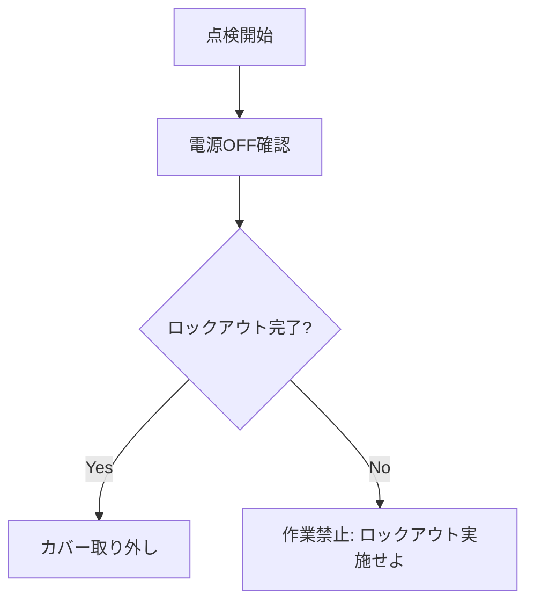
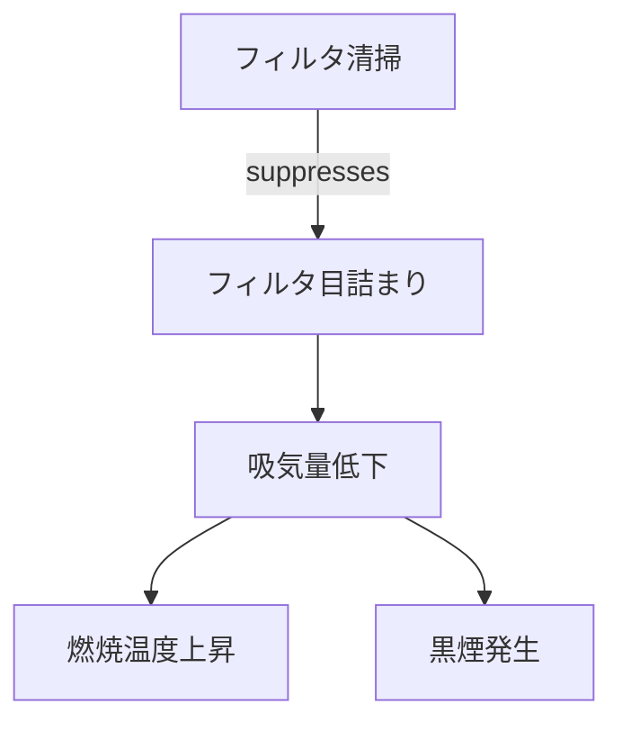

# 専門家の暗黙知を生成AIに教え込むための構造化手法

本ドキュメントは、専門家が持つ「暗黙知 (Tacit Knowledge)」を生成AIに効果的に学習・参照させるために、**「どのような種類の知識を、どのような形式に構造化すべきか」**という観点で分類・整理したものです。

ご指定の5つのカテゴリ順（事例、手順、ルール、意味、因果）に構成しています。

---

## 1. Episodic Knowledge (事例・経験知)
「過去にこういう状況でこう対処した」という個別のエピソード記憶です。抽象化されていない生の経験データであり、類似事例の検索に利用されます。

- **構造化の手法**: **Case-Based Reasoning (CBR)**
  - 事例を {Situation, Problem, Solution, Outcome} のフレームで保存する。
- **データ形式**: 構造化ログ、JSON形式の事例レコード。
- **活用イメージ**: 「似たようなトラブルが過去になかったか？」を検索し、解決策を借用する。

### 構造化データの例 (JSON)
```json
{
  "case_id": "EVT_2023_998",
  "situation": "気温35度以上の環境で、連続稼働時間が8時間を超えた",
  "problem": "油圧シリンダーの動作遅延が発生",
  "solution": "作動油クーラーのファンを確認し、清掃を実施した",
  "outcome": "油温が低下し、動作速度が正常化した"
}
```

---

## 2. Procedural Knowledge (手続き的知識)
「まずAを確認し、次にBを行う」という一連のプロセスやワークフローに関する知識です。時間の流れや順序性が重要になります。

- **構造化の手法**: **Decision Tree / Flowchart**
  - 標準作業手順（SOP）を分岐図として書き下す。
- **データ形式**: Mermaidフローチャート、BPMN。
- **活用イメージ**: 初心者でも迷わないように、診断や操作のステップバイステップガイドを提示する。

### 構造化データの例 (Mermaid: Flowchart)

> **参考文献**: *Sahoo, S. S., et al. "Language Models are Zero-Shot Decision Tree Extractors." (2024)*

---

## 3. Rule-Based Knowledge (制約・判断ルール)
「温度がX度を超えたら危険」「このモードでは操作Yは禁止」といった、静的な制約条件や安全基準に関する知識です。手順（フロー）とは異なり、常に満たすべき条件として定義されます。

- **構造化の手法**: **IF-THEN Rules / Thresholds**
  - 明確な閾値や禁止事項を論理式として定義する。
- **データ形式**: ルールセット、バリデーションロジック。
- **活用イメージ**: AIが生成した回答が安全基準に抵触していないかの監査（Guardrails）や、アラート判定。

### 構造化データの例 (Pseudo-Code: Rule Set)
```javascript
Rule_Safety_01:
  IF (Hydraulic_Pressure > 25.0 MPa) THEN (Status = DANGER)

Rule_Operation_02:
  IF (Mode == "Maintenance") THEN (Remote_Control = DISABLED)
```

---

## 4. Semantic / Relational Knowledge (意味的知識)
「部品AはユニットBの一部である」「用語Xと用語Yは同義である」といった、言葉の意味やモノ同士の関係性に関する知識です。

- **構造化の手法**: **Knowledge Graph / Ontology**
  - エンティティとリレーションによるネットワーク構築。
- **データ形式**: RDFトリプル, Property Graph (Mermaid/Neo4j)。
- **活用イメージ**: 表記揺れの吸収や、関連部品の特定（GraphRAGによる多段階推論）。

### 構造化データの例 (Mermaid: Knowledge Graph)

> **参考文献**: *Edge, D., et al. "From Local to Global: A Graph RAG Approach to Query-Focused Summarization." (2024)*

---

## 5. Causal Knowledge (因果的知識)
「Aが起きるとBになる」「Bの原因はCである」という因果関係やメカニズムに関する知識です。相関関係ではなく、介入（Action）に対する結果を予測するために必要です。

- **構造化の手法**: **Causal DAG (Directed Acyclic Graph) / Counterfactuals**
  - 原因と結果の方向性を有向グラフで定義する。
- **データ形式**: 因果ダイアグラム。
- **活用イメージ**: 根本原因分析（Why-Why分析）や、「もし設定を変えたらどうなるか」のシミュレーション。

### 構造化データの例 (Mermaid: Causal DAG)

> **参考文献**: *Kiciman, E., et al. "Causal Reasoning and Large Language Models." (2023)*