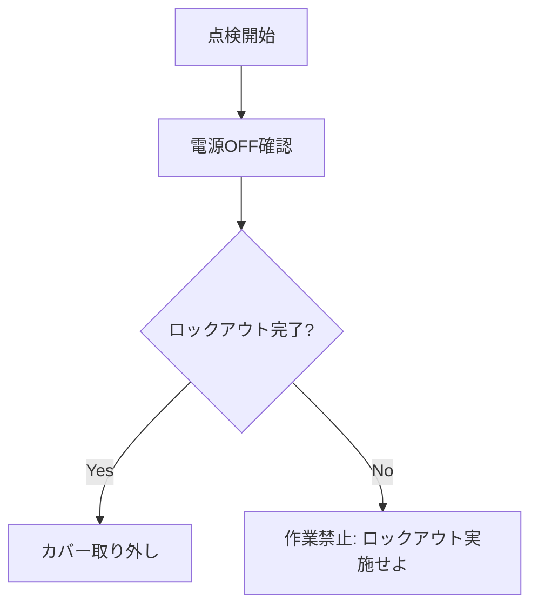
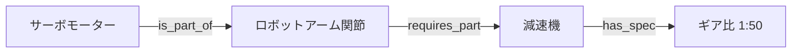
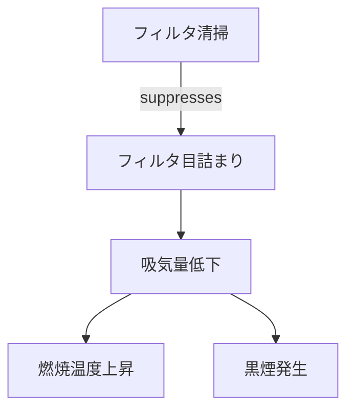

# 専門家の暗黙知を生成AIに教え込むための構造化手法

本ドキュメントは、専門家が持つ「暗黙知 (Tacit Knowledge)」を生成AIに効果的に学習・参照させるために、**「どのような種類の知識を、どのような形式に構造化すべきか」**という観点で分類・整理したものです。

実務上の実行難易度順に、具体的な**学術的手法名**と**データ構造**、および**活用事例**を記載しています。

---

## 1. Episodic Knowledge (事例・経験知)
**【難易度: 低】**

「過去にこういう状況でこう対処した」という個別のエピソード記憶です。抽象化されていない生の経験データであり、**類似事例検索による問題解決（類推）** に利用されます。ログ・FAQ・チケット・障害記録など、既存データを活用しやすく、最も着手しやすい領域です。

- **構造化のゴール**: **Structured Case Frame (構造化ケース)**
- **学術的手法・アプローチ**:
  - **Case-Based Reasoning (CBR)** / **Example-based RAG / CBR-RAG**
    - 古典的なCBR（Retrieve, Reuse, Revise, Retain）をLLMで強化するアプローチ。
    - LLMの文脈理解力を用いて、事例検索（Retrieval）と現在状況への適用（Adaptation）を行う。
  - **Neural CBR**
    - 類似度計算や適応をニューラルモデルで高度化する拡張形。

### 活用事例
- **建設現場の安全管理**:
  - **東洋建設 (K-SAFE)**: 過去の労働災害事例やヒヤリハット報告をRAGで検索可能にし、現場特有の状況に応じた安全指導事項を自動提案。
    - [【東洋建設】統合検索プラットフォーム 「TOYO ChatGPT RAG適用版」を導入 (PR TIMES)](https://prtimes.jp/main/html/rd/p/000000057.000107545.html)
- **ヘルプデスク業務**:
  - **LINEヤフー**: 社内問い合わせ対応において過去のチケットログをRAGで活用し、約98%の正答率を達成。
    - [LINEヤフー、社内向け独自業務効率化ツール「SeekAI」を全従業員に導入 (PR TIMES)](https://prtimes.jp/main/html/rd/p/000000188.000129774.html)

### 構造化データの例 (JSON)
```json
{
  "case_id": "EVT_2023_998",
  "situation": "気温35度以上の環境で、連続稼働時間が8時間を超えた",
  "problem": "油圧シリンダーの動作遅延が発生",
  "solution": "作動油クーラーのファンを確認し、清掃を実施した",
  "outcome": "油温が低下し、動作速度が正常化した"
}
```

> **参考文献**:
> - Das, R., et al. *Case-based Reasoning for Better Generalization in Text Generation.* (ICLR 2023)
> - Lewis, P., et al. *Retrieval-Augmented Generation for Knowledge-Intensive NLP Tasks.* (NeurIPS 2020)

---

## 2. Procedural Knowledge (手続き的知識)
**【難易度: 中】**

「まずAを確認し、次にBを行う」という一連の**プロセス・順序・ワークフロー**に関する知識です。
時間的順序や状態遷移が重要であり、**作業手順や診断フローの再現** に適しています。

※ 本カテゴリは「どう進めるか（flow）」を定義するものであり、後述の Rule-Based Knowledge（制約・禁止事項）とは役割が異なります。

- **構造化のゴール**: **Procedural Knowledge Graph (PKG) / Decision Tree / Flowchart**
- **学術的手法・アプローチ**:
  - **Zero-Shot Process Extraction**
    - テキストからアクション（Action）、対象（Object）、状態（State）を抽出しプロセスグラフ化
  - **Chain-of-Thought Distillation**
    - 熟練者の思考手順（CoT）を固定的なステップとして蒸留

### 活用事例
- **技術伝承 (建設業)**:
  - **熊谷組**: ベテラン技術者のノウハウをナレッジベース化し、若手への技術継承や現場での即時検索に活用（Knowledge Explorer導入）。
    - [【ナレッジ活用事例】熊谷組：世代間の交流をサポートし、長年培ってきた知見を継承！ (図研プリサイト)](https://www.presight.co.jp/case/example/kumagaigumi.html)
- **製造業の標準作業手順 (SOP) 自動生成**:
  - 熟練者の操作ログや非構造化マニュアルから「正しい手順」を抽出し、新人オペレーター向けのデジタルガイドおよびトラブルシューティングフローを自動生成。

### 構造化データの例 (Mermaid: Flowchart)

> **参考文献**:
> - Zhang, L., et al. *Reasoning with Procedural Knowledge Graphs.* (CL 2023)
> - Sahoo, S. S. *Language Models are Zero-Shot Decision Tree Extractors.* (2024)

---

## 3. Rule-Based Knowledge (制約・判断ルール)
**【難易度: 中〜高】**

「温度がX度を超えたら危険」「操作Yは禁止」といった、**静的な制約条件・安全基準・閾値判定**に関する知識です。

Procedural Knowledge が「どう進めるか（flow）」を定義するのに対し、
Rule-Based Knowledge は **「絶対に違反してはならない制約（constraints）」を定義する** 点が本質的に異なります。

安全・法令・品質保証など、**LLMに判断を委ねるべきでない領域**を明示的に切り出すために不可欠です。

- **構造化のゴール**: **Symbolic Constraints / Logic Rules**
- **学術的手法・アプローチ**:
  - **Neuro-Symbolic AI**
    - ニューラル（LLM）とシンボリック（ルール）の統合
  - **Constrained Decoding / Safe Decoding**
    - 生成時に論理制約を強制し、違反出力を物理的に防止

### 活用事例
- **金融コンプライアンス & AML (RegTech)**:
  - **HSBC等**: AIによる不正検知に加え、"Neuro-symbolic AI"的なアプローチを用いて「なぜ不正と判定されたか」を明確なルールに基づいて説明（監査対応）。
    - [How HSBC fights money launderers with artificial intelligence (Google Cloud Blog)](https://cloud.google.com/blog/topics/financial-services/how-hsbc-fights-money-laundering-with-ai)
- **産業用制御**:
  - LLMが生成した制御コマンドに対し、物理的な安全閾値ルールを適用して、危険な動作指令をブロックするガードレール機構。

### 構造化データの例 (Pseudo-Code: Rule Set)
```javascript
Rule_Safety_01:
  IF (Hydraulic_Pressure > 25.0 MPa) THEN (Status = DANGER)

Rule_Operation_02:
  IF (Mode == "Maintenance") THEN (Remote_Control = DISABLED)
```

> **参考文献**:
> - Garcez, A. D., et al. *Neuro-Symbolic Artificial Intelligence: The State of the Art.* (2022)
> - Microsoft Guidance / AICI

---

## 4. Semantic / Relational Knowledge (意味的知識)
**【難易度: 高】**

「部品AはユニットBの一部」「XはYを必要とする」といった、**概念・属性・関係性**に関する知識です。
ドメイン全体の構造（製品構成、依存関係、用語体系）を明示化します。

- **構造化のゴール**: **Knowledge Graph / Ontology**
- **学術的手法・アプローチ**:
  - **GraphRAG**
  - **Ontology Engineering / Ontology Learning**
  - トリプレット抽出（Subject–Predicate–Object）

### 活用事例
- **データ統合・分析 (Manufacturing Data Hub)**:
  - **NEC**: 異なるシステムのデータをナレッジグラフで紐付け、データ間の隠れたつながりを発見するリンク予測AI等を開発。
    - [データ間の隠れたつながりを発見するリンク予測AI (NEC)](https://jpn.nec.com/techrep/journal/g20/n01/200115.html)
- **サプライチェーン管理**:
  - **富士通**: サプライチェーン全体をグラフ化し、災害時の影響波及範囲を即座に特定・可視化（Trusted AI）。
    - [特化型AIエージェントでグローバルサプライチェーンを最適化するソリューション (富士通)](https://pr.fujitsu.com/jp/news/2024/07/14-1.html)

### 構造化データの例 (Mermaid: Knowledge Graph)

> **参考文献**:
> - Edge, D., et al. *Graph RAG Approach to Query-Focused Summarization.* (ArXiv 2024)
> - Pan, J. Z., et al. *Large Language Models and Knowledge Graphs.* (2024)

---

## 5. Causal Knowledge (因果的知識)
**【難易度: 最高】**

「Aが起きるとBになる」「この操作をすると結果が変わる」といった、**メカニズムや介入可能な因果関係**に関する知識です。
根本原因分析（RCA）や「なぜ？」への説明、介入効果の予測に利用されます。

※ 因果グラフは Knowledge Graph の一種であり、関係の中でも **方向性と介入可能性（intervention）を明示した特殊化モデル** とみなせます。

- **構造化のゴール**: **Causal DAG (Directed Acyclic Graph)**
- **学術的手法・アプローチ**:
  - **Causal Discovery with LLMs**
  - **Counterfactual Reasoning**
  - **Structural Causal Models (SCM)**

### 活用事例
- **マーケティング効果検証**:
  - **電通**: 単なる相関ではなく、交絡因子を考慮した「因果推論」を用いて、広告施策の真の効果（リフト値）を検証。
    - [因果推論研究者と考える、広告効果の本質 (ウェブ電通報)](https://dentsu-ho.com/articles/7660)
- **故障予兆・根本原因分析**:
  - センサーデータ（温度上昇）と故障実績の相関だけでなく、LLMを用いた技術文書解析により「冷却ファン劣化が真因である」という因果構造を特定。

### 構造化データの例 (Mermaid: Causal DAG)

> **参考文献**:
> - Kiciman, E., et al. *Causal Reasoning and Large Language Models.* (ArXiv 2023)
> - Willig, M., et al. *Can Large Language Models Infer Causality?* (ArXiv 2023)