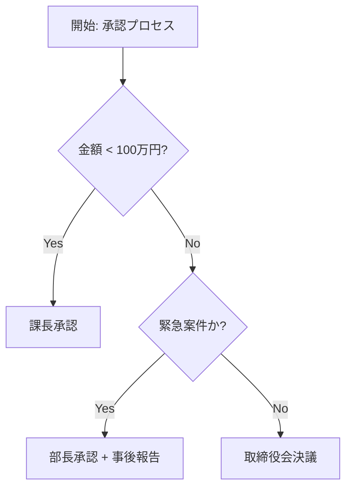
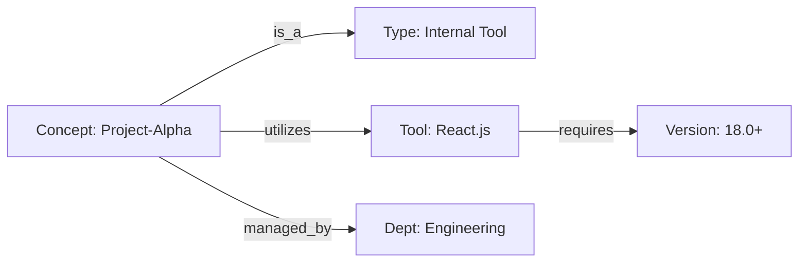
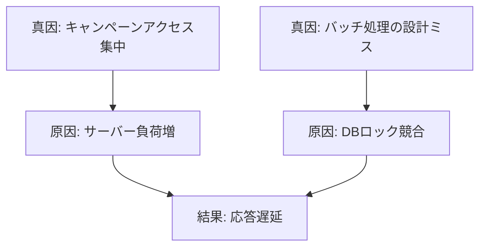

# 専門家の暗黙知を生成AIに教え込むための構造化手法

本ドキュメントは、専門家が持つ「暗黙知 (Tacit Knowledge)」を生成AIに効果的に学習・参照させるために、**「どのような種類の知識を、どのような形式に構造化すべきか」**という観点で分類・整理したものです。

実務上、導入・実行の難易度が低い（平易な）順に記載しています。

---

## 1. エピソード知識の構造化 (Episodic Knowledge Structuring)
**【難易度: 低】**
「過去にこんな事例があった」という具体的な経験知です。個別の事例から類似の状況を解決するための知識であり、既存のログやチケットデータを整理するだけで始められるため、最も着手しやすい領域です。

- **構造化のゴール**: **構造化事例フォーマット (Structured Case Frame)**
  - **Case-Based Reasoning (CBR)** の考え方に基づき、{状況, 問題, 解決策, 結果} のセットで保存します。
- **学術的アプローチ**:
  - **Case Retrieval & Adaptation**: 類似事例を検索し、現在の状況に合わせて解決策を修正・適用する。

### 構造化データの例 (JSON: 構造化ケース)
```json
{
  "case_id": "case_2023_001",
  "context": {
    "situation": "セキュリティアップデート後の起動不能",
    "environment": "OS: Linux, Kernel: 5.15"
  },
  "problem": "ブートローダーで停止し、ログイン画面に到達しない",
  "solution": "旧カーネルでの起動を選択し、グラフィックドライバを再インストールした",
  "outcome": "正常起動を確認。ドライバの非互換性が原因と判明。"
}
```

---

## 2. 手続き的知識の構造化 (Procedural Knowledge Structuring)
**【難易度: 中】**
「どういう手順で判断するか」「Yes/Noの分岐基準は何か」という、専門家の思考プロセスに関する知識です。マニュアルやSOP（標準作業手順書）として既に明文化されていることが多く、それをデジタルなルールに変換する作業が主となります。

- **構造化のゴール**: **決定木 (Decision Tree) / フローチャート**
  - 条件分岐論理（IF-THENルール）として明確に書き下します。
- **学術的アプローチ**:
  - **Zero-Shot Decision Tree Extraction**: LLMの推論能力を利用して、テキストから決定木を生成する。
  - **Chain-of-Thought Distillation**: 思考のステップをルールとして固定化する。

### 構造化データの例 (Mermaid: フローチャート)

> **参考文献**: *Sahoo, S. S., et al. "Language Models are Zero-Shot Decision Tree Extractors." (2024)*

---

## 3. 意味的知識の構造化 (Semantic Knowledge Structuring)
**【難易度: 高】**
専門家が持つ「言葉の定義」「概念の包含関係」「製品構成」などの知識です。用語間の網羅的な繋がり（ネットワーク）を定義する必要があり、設計（オントロジー構築）に専門的なスキルと多くの工数を要します。

- **構造化のゴール**: **ナレッジグラフ (Knowledge Graph)**
  - エンティティ（ノード）と関係性（エッジ）のネットワークとして表現します。
- **学術的アプローチ**:
  - **GraphRAG**: LLMを用いて非構造化テキストからグラフ構造を抽出し、検索に利用する。
  - **Ontology Engineering**: 厳密な概念体系（クラス、プロパティ）を設計する。

### 構造化データの例 (Mermaid: エンティティ関係図)

> **参考文献**: *Edge, D., et al. "From Local to Global: A Graph RAG Approach to Query-Focused Summarization." (2024)*

---

## 4. 因果的知識の構造化 (Causal Knowledge Structuring)
**【難易度: 最高】**
「なぜそれが起きたのか」「Aを変えるとBにどう影響するか」というメカニズムや因果関係に関する知識です。目に見えない関係性をモデル化する必要があり、正解の検証も難しいため、最も高度な取り組みとなります。

- **構造化のゴール**: **因果グラフ (Causal DAG / Directed Acyclic Graph)**
  - 事象間の因果の方向と強さを定義します。
- **学術的アプローチ**:
  - **Causal Discovery**: テキストデータや観測データから因果構造を推定する。
  - **Counterfactual Reasoning**: 「もし〜だったら」という反事実的な問いに対する推論を支援する。

### 構造化データの例 (Mermaid: 因果チェーン)

> **参考文献**: *Kiciman, E., et al. "Causal Reasoning and Large Language Models." (2023)*