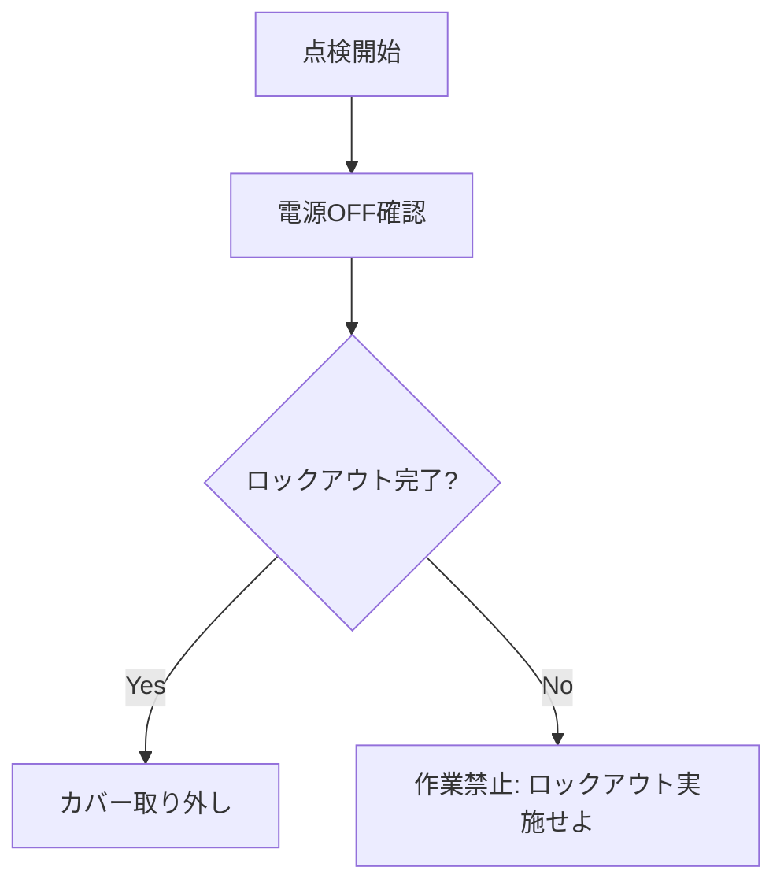
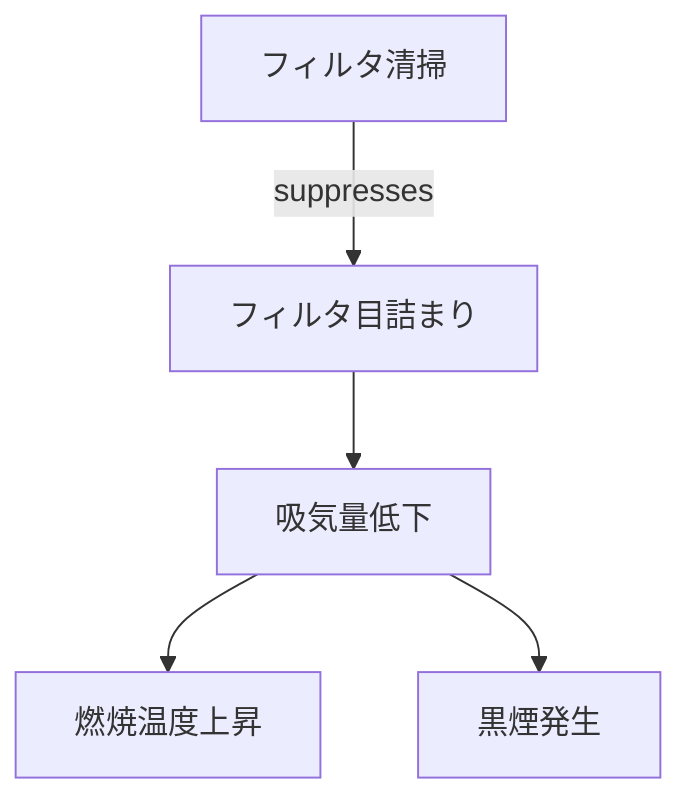

# 専門家の暗黙知を生成AIに教え込むための構造化手法

本ドキュメントは、専門家が持つ「暗黙知 (Tacit Knowledge)」を生成AIに効果的に学習・参照させるために、**「どのような種類の知識を、どのような形式に構造化すべきか」**という観点で分類・整理したものです。

実務上の実行難易度順に、具体的な**学術的手法名**と**データ構造**を記載しています。

---

## 1. Episodic Knowledge (事例・経験知)
**【難易度: 低】**
「過去にこういう状況でこう対処した」という個別のエピソード記憶です。抽象化されていない生の経験データであり、類似事例の検索に利用されます。

- **構造化のゴール**: **Structured Case Frame (構造化ケース)**
- **学術的手法・アプローチ**:
  - **Neural Case-Based Reasoning (Neural CBR)** / **CBR-RAG**
    - 古典的なCBR（事例ベース推論）のプロセス（Retrieve, Reuse, Revise, Retain）をLLMで強化するアプローチ。
    - LLMの文脈理解力を用いて、事例の検索（Retrieval）と現在の状況への修正適用（Adaptation）を行う。

### 構造化データの例 (JSON)
```json
{
  "case_id": "EVT_2023_998",
  "situation": "気温35度以上の環境で、連続稼働時間が8時間を超えた",
  "problem": "油圧シリンダーの動作遅延が発生",
  "solution": "作動油クーラーのファンを確認し、清掃を実施した",
  "outcome": "油温が低下し、動作速度が正常化した"
}
```
> **参考文献**:
> - *Das, R., et al. "Case-based Reasoning for Better Generalization in Text Generation." (ICLR 2023)*
> - *Lewis, P., et al. "Retrieval-Augmented Generation for Knowledge-Intensive NLP Tasks." (NeurIPS 2020)*

---

## 2. Procedural Knowledge (手続き的知識)
**【難易度: 中】**
「まずAを確認し、次にBを行う」という一連のプロセスやワークフローに関する知識です。時間の流れや順序性が重要になります。

- **構造化のゴール**: **Procedural Knowledge Graph (PKG) / Decision Tree**
- **学術的手法・アプローチ**:
  - **Zero-Shot Process Extraction**
    - 非構造化テキスト（マニュアル等）から、アクション（Action）、対象（Object）、状態遷移（State）を抽出し、プロセスグラフを構築する。
  - **Chain-of-Thought Distillation**
    - 熟練者の思考プロセス（CoT）をステップごとのルールとして蒸留・固定化する。

### 構造化データの例 (Mermaid: Flowchart)

> **参考文献**:
> - *Zhang, L., et al. "Reasoning with Procedural Knowledge Graphs." (CL 2023)*
> - *Sahoo, S. S. "Language Models are Zero-Shot Decision Tree Extractors." (2024)*

---

## 3. Rule-Based Knowledge (制約・判断ルール)
**【難易度: 中〜高】**
「温度がX度を超えたら危険」「操作Yは禁止」といった、静的な制約条件や安全基準に関する知識です。

- **構造化のゴール**: **Symbolic Constraints / Logic Rules**
- **学術的手法・アプローチ**:
  - **Neuro-Symbolic AI**
    - ニューラルネットワーク（LLM）の柔軟性と、シンボリックAI（ルールエンジン）の厳密性を統合するアプローチ。
  - **Constrained Decoding (Safe Decoding)**
    - LLMの出力生成時に、文法規則や論理制約（Guidance, AICI等を使用）を強制し、ルール違反を物理的に防ぐ。

### 構造化データの例 (Pseudo-Code: Rule Set)
```javascript
Rule_Safety_01:
  IF (Hydraulic_Pressure > 25.0 MPa) THEN (Status = DANGER)

Rule_Operation_02:
  IF (Mode == "Maintenance") THEN (Remote_Control = DISABLED)
```
> **参考文献**:
> - *Garcez, A. D., et al. "Neuro-Symbolic Artificial Intelligence: The State of the Art." (2022)*
> - *Microsoft Guidance / AICI (Architecture for Interleaved Computation and Inference)*

---

## 4. Semantic / Relational Knowledge (意味的知識)
**【難易度: 高】**
「部品AはユニットBの一部である」といった、言葉の意味やモノ同士の関係性に関する知識です。

- **構造化のゴール**: **Knowledge Graph (Ontology)**
- **学術的手法・アプローチ**:
  - **GraphRAG** (Microsoft Research)
    - テキストから知識グラフを構築し、グラフコミュニティ検出を用いて、単純な検索では見つからない「全体像」や「隠れた繋がり」を回答させる。
  - **Ontology Learning**
    - 既存の知識体系（オントロジー）に基づき、テキストからトリプレット（主語-述語-目的語）を抽出する。

### 構造化データの例 (Mermaid: Knowledge Graph)

> **参考文献**:
> - *Edge, D., et al. "From Local to Global: A Graph RAG Approach to Query-Focused Summarization." (ArXiv 2024)*
> - *Pan, J. Z., et al. "Large Language Models and Knowledge Graphs: Opportunities and Challenges." (2024)*

---

## 5. Causal Knowledge (因果的知識)
**【難易度: 最高】**
「Aが起きるとBになる」という因果関係やメカニズムに関する知識です。介入（Action）に対する結果を予測するために必要です。

- **構造化のゴール**: **Causal DAG (Directed Acyclic Graph)**
- **学術的手法・アプローチ**:
  - **Causal Discovery with LLMs**
    - ドメイン知識を持つLLMを用いて、変数間の因果グラフ（A→B）を推定・構築する。
  - **Counterfactual Reasoning (反事実的推論)**
    - 「もしXしていなかったらYはどうなっていたか？」を推論し、根本原因分析（RCA）を行う。

### 構造化データの例 (Mermaid: Causal DAG)

> **参考文献**:
> - *Kiciman, E., et al. "Causal Reasoning and Large Language Models: Opening a New Frontier for Causality." (ArXiv 2023)*
> - *Willig, M., et al. "Can Large Language Models Infer Causality?" (ArXiv 2023)*